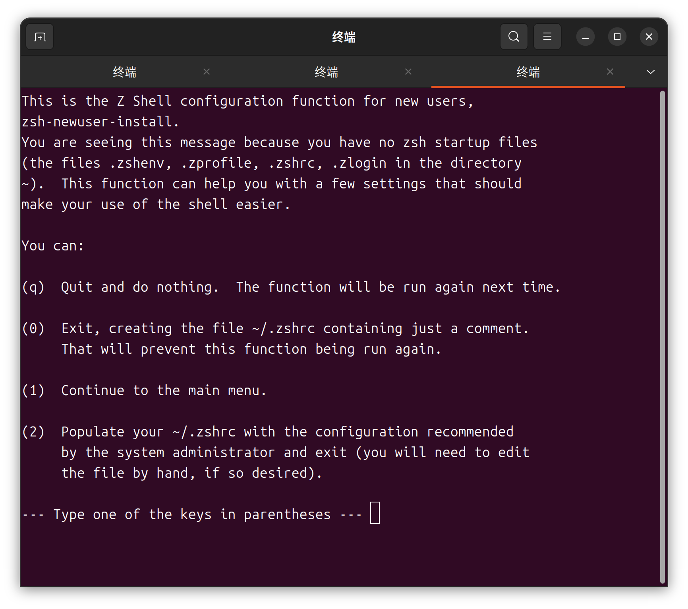

# Ubuntu

## zsh

下载安装zsh

```bash
sudo apt-get install zsh
```

将zsh设置为默认shell并且注销一次

```bash
chsh -s $(which zsh)
```

选择2创建`~/.zshrc`文件

 

## oh-my-zsh + powerlevel10k

安装oh-my-zsh

```bash
wget https://raw.githubusercontent.com/ohmyzsh/ohmyzsh/master/tools/install.sh
sh install.sh
```

安装powerlevel10k

```bash
git clone --depth=1 https://github.com/romkatv/powerlevel10k.git ${ZSH_CUSTOM:-$HOME/.oh-my-zsh/custom}/themes/powerlevel10k
```

修改`.zshrc`，将zsh主题改为powerlevel10k

```bash
ZSH_THEME="powerlevel10k/powerlevel10k"
```

重启终端

```bash
source ~/.zshrc
```

可用以下命令随时配置powerlevel10k

```bash
p10k configure
```

## 安装zsh插件

zsh-completions

```bash
  git clone https://github.com/zsh-users/zsh-completions ${ZSH_CUSTOM:-${ZSH:-~/.oh-my-zsh}/custom}/plugins/zsh-completions
```

zsh-autosuggestions

```bash
git clone https://github.com/zsh-users/zsh-autosuggestions ${ZSH_CUSTOM:-~/.oh-my-zsh/custom}/plugins/zsh-autosuggestions
```

zsh-syntax-highlighting

```bash
git clone https://github.com/zsh-users/zsh-syntax-highlighting.git ${ZSH_CUSTOM:-~/.oh-my-zsh/custom}/plugins/zsh-syntax-highlighting
```

在`~/.zshrc`中启用插件

```
plugins=(
git
zsh-completions 
zsh-autosuggestions 
zsh-syntax-highlighting
)
```


